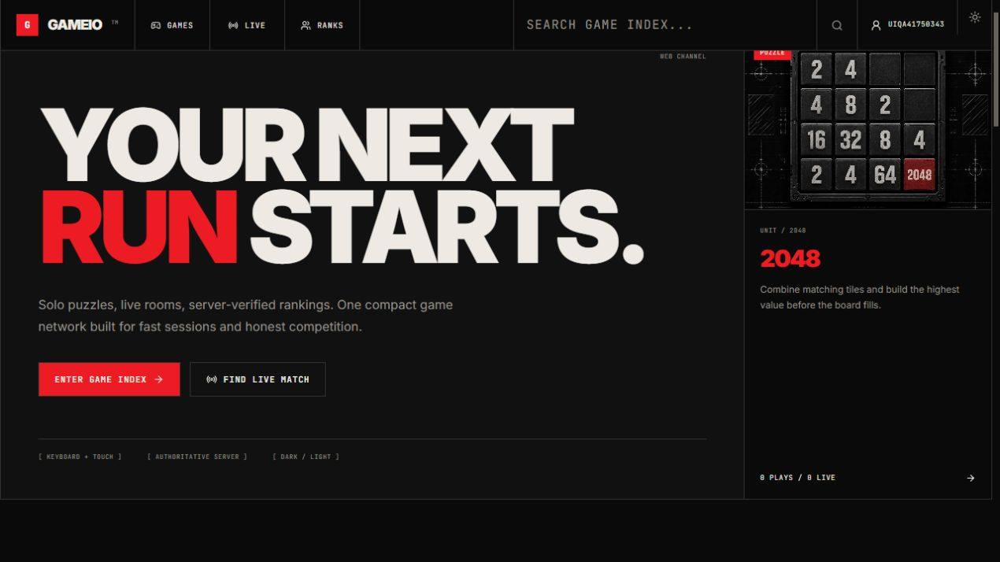
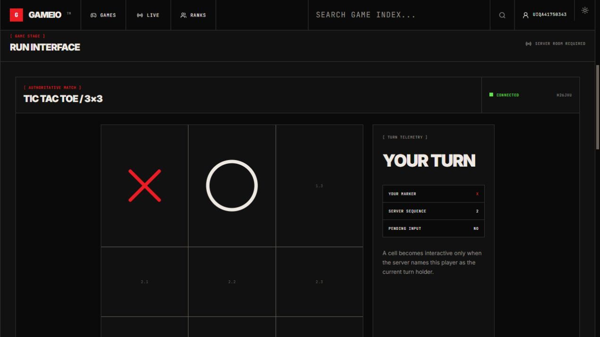
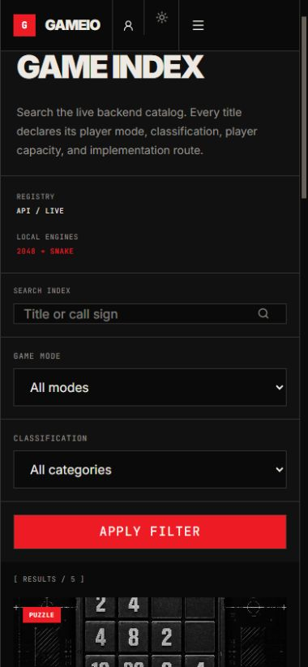

# Gameio

Gameio is a full-stack mini-game platform with real browser games, player accounts, progression, rankings, friends, private rooms and online matchmaking. The web portal is a Next.js application; the Java backend is a feature-oriented modular monolith that owns identity, durable results and authoritative multiplayer state.

The implementation deliberately keeps one application backend instead of introducing microservices or Kafka. Game-specific rules sit behind registries and engine interfaces so a title can be added without putting game logic into route pages or transport handlers.

## What is implemented

- Registration, login, short-lived JWT access tokens, rotating opaque refresh tokens, logout and refresh-token reuse protection.
- Public profiles, avatar update, match history, EXP/levels, achievements, global and per-game leaderboards.
- Friends, incoming/outgoing requests, accept/reject/remove and Redis-backed online/current-game presence.
- Catalog search/filters, real persisted play counts and active-room/session-derived online counts, responsive light/dark portal UI, loading/error/empty states and local generated game artwork.
- Private rooms, public room listing, join by code, ready/start/leave, quick matchmaking and reconnect handling.
- A single authenticated WebSocket transport shared by Tic Tac Toe, Caro and Tank Battle. Clients send inputs; the server validates membership, turns, movement, collisions, HP and terminal outcomes.
- PostgreSQL/Flyway for durable data and Redis for ephemeral room, queue, presence and short-lived leaderboard-cache data.

### Games

| Game | Runtime | Result trust boundary |
| --- | --- | --- |
| 2048 | React/TypeScript | Seeded session and server replay verification before persistence |
| Snake | Phaser | Server-seeded deterministic run and replay verification before persistence |
| Tic Tac Toe | Spring authoritative engine | Server validates turns and a 3 by 3 win/draw |
| Caro | Spring authoritative engine | Server validates turns and five-in-a-row on a 15 by 15 board |
| Tank Battle | Phaser renderer + Spring tick engine | Client sends movement/shoot actions; server owns positions, rotation, bullets, HP and game over |

## Architecture

```text
Browser
  |-- same-origin HTTPS /api/*
  |       `-- Cloudflare OpenNext BFF -- HTTPS --> Spring Boot
  `-- direct WSS /ws ---------------------------> Spring Boot
                                                     |-- PostgreSQL: durable records
                                                     `-- Redis: rooms, queues, presence
```

The production Cloudflare worker proxies only the fixed `/api/*` namespace to the configured backend origin, rejects request bodies over 1 MiB and disables caching. This keeps the refresh cookie first-party on the frontend host. WebSocket traffic connects directly to the continuously running Railway backend and authenticates with WebSocket subprotocols, never a query-string token.

The active multiplayer engine is process-local in this first release, so production uses one warm backend replica. Redis retains room metadata, but a process restart cannot reconstruct a match in progress; the client receives `ROOM_EXPIRED` and returns to the lobby safely.

More detail: [architecture](docs/architecture.md), [security](docs/security.md), and [WebSocket protocol](docs/websocket-protocol.md).

## Technology stack

- Frontend: Next.js 16.3.0, React 19.2.8, TypeScript, Tailwind CSS 4, local shadcn-style components, TanStack Query, Zustand and Phaser 4.0.0.
- Backend: Java 21, Spring Boot 4.1.0, Spring Security, Spring Data JPA, Spring WebSocket and Flyway.
- Data: PostgreSQL 17 and Redis 7.4.
- Delivery: Docker Compose, GitHub Actions, Cloudflare Workers through OpenNext 1.20.2/Wrangler 4.120.0, and Railway.

## Repository structure

```text
gameio/
|-- assets/game-art/       Generated source artwork and WebP exports
|-- backend/               Spring Boot modular monolith and tests
|-- docs/                  Architecture, API, protocol and operations guides
|-- frontend/              Next.js portal and isolated game modules
|-- infrastructure/        Deployment notes
|-- scripts/               HTTP and realtime production-capable smoke tests
|-- docker-compose.yml
`-- .env.example
```

Backend packages are grouped by feature (`auth`, `user`, `game`, `gameresult`, `leaderboard`, `achievement`, `friend`, `room`, `matchmaking`, `multiplayer`, `common`). JPA entities are not returned directly by controllers.

Frontend game code lives under `frontend/src/games`; pages resolve titles through `games/core/game-registry.tsx`. Shared HTTP and WebSocket clients live outside individual games.

## Requirements

The one-command setup requires Docker Desktop with Docker Compose v2. Direct source development requires Java 21 and Node.js 22 or newer; the Maven Wrapper is committed, so a separate Maven installation is unnecessary.

## Run locally with Docker

From the repository root:

```powershell
Copy-Item .env.example .env
docker compose up --build
```

- Portal: `http://localhost:3000`
- Backend health: `http://localhost:8080/actuator/health`
- WebSocket: `ws://localhost:8080/ws`

If host port `8080` is already in use, change only the host-facing values in `.env` before building:

```text
BACKEND_HOST_PORT=18080
NEXT_PUBLIC_WS_URL=ws://localhost:18080/ws
```

Keep `BACKEND_ORIGIN=http://backend:8080`: container-to-container traffic still uses the backend's internal port. The equivalent frontend override is `FRONTEND_HOST_PORT`; when changing it, also update the exact local `CORS_ALLOWED_ORIGINS` origin.

For the `18080` example, run smoke with `-BaseUrl http://localhost:18080` and realtime smoke with both that base URL and `-WsUrl ws://localhost:18080/ws`.

The values in `.env.example` are development-only. Never copy its credentials or signing secret into a hosted environment.

Stop containers without deleting database volumes:

```powershell
docker compose down
```

## Direct source development

Start only the data services:

```powershell
docker compose up -d postgres redis
```

Run the backend in one PowerShell window:

```powershell
Set-Location backend
$env:DB_PASSWORD = "gameio_dev_password"
cmd /c .\mvnw.cmd spring-boot:run
```

Run the frontend in another:

```powershell
Set-Location frontend
Copy-Item .env.example .env.local
npm ci
npm run dev
```

That frontend example uses the local same-origin `/api` BFF with `BACKEND_ORIGIN=http://localhost:8080`. Delete `.env.local` or set an explicit absolute `NEXT_PUBLIC_API_URL` only when intentionally testing direct browser-to-backend REST locally.

## Environment variables

### Browser build configuration

| Variable | Local Docker | Cloudflare production | Meaning |
| --- | --- | --- | --- |
| `NEXT_PUBLIC_API_URL` | `/api` | `/api` | Same-origin namespace used by the centralized browser API client |
| `NEXT_PUBLIC_WS_URL` | `ws://localhost:8080/ws` | `wss://<railway-host>/ws` | Direct realtime endpoint |

`NEXT_PUBLIC_*` values are public and are embedded at build time. They must never contain credentials.

### Frontend BFF runtime configuration

| Variable | Local Docker | Cloudflare production | Meaning |
| --- | --- | --- | --- |
| `BACKEND_ORIGIN` | `http://backend:8080` | `https://<railway-host>` | Fixed plain upstream used by `/api/*`; no credentials, application path, query or fragment |

### Backend runtime configuration

| Variable | Required in production | Notes |
| --- | --- | --- |
| `SPRING_PROFILES_ACTIVE` | `prod` | Enables production database parsing, secure-cookie defaults and secret guard |
| `DATABASE_URL` | Railway PostgreSQL URL | `postgres://`, `postgresql://`, or JDBC form; `DB_URL`/`JDBC_DATABASE_URL` are also accepted |
| `DB_USERNAME`, `DB_PASSWORD` | When not embedded in the URL | `PGUSER`/`PGPASSWORD` are accepted fallbacks |
| `REDIS_URL` | Railway private Redis URL | Host/port/user/password variables are supported as a fallback |
| `JWT_SECRET` | Random value of at least 32 UTF-8 bytes | Production refuses the repository fallback; use at least 64 random bytes |
| `JWT_ISSUER` | Stable issuer, normally `gameio-api` | Must remain consistent for issued and decoded access tokens |
| `JWT_ACCESS_TTL` | For example `15m` | Keep short; an access token remains valid until expiry |
| `JWT_REFRESH_TTL` | For example `30d` | Rotating refresh-family lifetime |
| `CORS_ALLOWED_ORIGINS` | Exact Cloudflare HTTPS origin | Used by REST CORS and WebSocket Origin validation; comma-separated when multiple exact origins are required |
| `REFRESH_COOKIE_SECURE` | `true` | Required over HTTPS |
| `REFRESH_COOKIE_SAME_SITE` | `Lax` | Correct for the same-origin Cloudflare BFF |
| `REFRESH_COOKIE_DOMAIN` | Empty | Produces a narrowly scoped host-only cookie |
| `PORT` | Supplied by Railway | Backend listens on this value |

See [deployment](docs/deployment.md) for the deployment order and complete preflight gate.

## Database

Flyway migrations under `backend/src/main/resources/db/migration` create the schema, indexes, five catalog games, achievements, friendships and authoritative multiplayer result linkage. Hibernate uses `ddl-auto=validate`; it never recreates production tables.

PostgreSQL is the source of truth for accounts, refresh-token hashes, catalog metadata, results, progression, achievements and friendships. Redis is disposable: it stores presence, queues, room metadata and a 30-second versioned leaderboard response cache. A cache miss/failure reads PostgreSQL; committed results bump the global and affected-game cache generations.

## Authentication and WebSocket model

The browser keeps the access token in memory. The refresh token is an HttpOnly cookie scoped to `/api/auth`; refresh rotates the token and logout revokes its family. Auth POST requests require `X-Gameio-CSRF: 1`.

WebSocket clients open `/ws` with these subprotocols:

```text
gameio.v1
gameio.jwt.<access-token>
```

The server validates the JWT and negotiates only `gameio.v1`, so the credential is not echoed and never appears in the URL. See the [protocol reference](docs/websocket-protocol.md) for exact envelopes, commands, events, limits and restart behavior.

## Game architecture and adding a title

Each title has one catalog slug shared by the database, frontend registry and any backend verifier/authoritative engine. Rendering is isolated from game rules. Multiplayer engines implement a common state/input boundary, and trusted results are created only after server validation.

The complete extension sequence and required tests are in [Adding a game](docs/game-extension.md).

## API overview

REST endpoints are rooted at `/api`. Public reads cover the catalog, public profiles, achievements and leaderboards. Account, result, friend, room and matchmaking operations require a bearer access token. The main route table and request notes are in [API overview](docs/api-overview.md).

## Build and verification

Backend:

```powershell
Set-Location backend
cmd /c .\mvnw.cmd -B -ntp clean verify
```

Frontend:

```powershell
Set-Location frontend
npm ci --no-audit --no-fund
npm run check
npm run cf:build
```

Compose and local smoke tests:

```powershell
docker compose config --quiet
docker compose up --build -d
.\scripts\smoke.ps1
.\scripts\realtime-smoke.ps1
```

The realtime smoke registers two unique users, negotiates two authenticated sockets, creates a Tic Tac Toe room, plays a deterministic server-authoritative win and verifies the persisted `WIN`/`LOSS` records. Both smoke scripts accept live URLs and avoid printing credentials; they create durable test accounts/results because no destructive account-delete API exists.

GitHub Actions repeats Maven verification, frontend lint/typecheck/tests/build, Compose validation and container builds on pushes and pull requests.

## Visuals

Custom game artwork and its reproducible [generation prompts](assets/game-art/PROMPTS.md) are versioned under `assets/game-art`, including the production WebP assets used by the portal:


Release screenshots are generated from the real browser runtime during the final QA pass. The README links only images that were actually captured from a working build.







## Roadmap

- Persist or externalize active engine state before running more than one realtime backend replica.
- Implement the reserved friend-to-room `GAME_INVITE` delivery/expiry contract documented in the WebSocket guide; invitation sending is not part of the current release.
- Add provider-independent automated backup/restore drills and production observability.
- Extract the realtime boundary to a dedicated game server only when scale justifies it; the current protocol keeps that migration possible without rewriting accounts or progression.

## Further documentation

- [Architecture](docs/architecture.md)
- [API overview](docs/api-overview.md)
- [WebSocket protocol](docs/websocket-protocol.md)
- [Adding a game](docs/game-extension.md)
- [Deployment](docs/deployment.md)
- [Security release checklist](docs/security.md)
